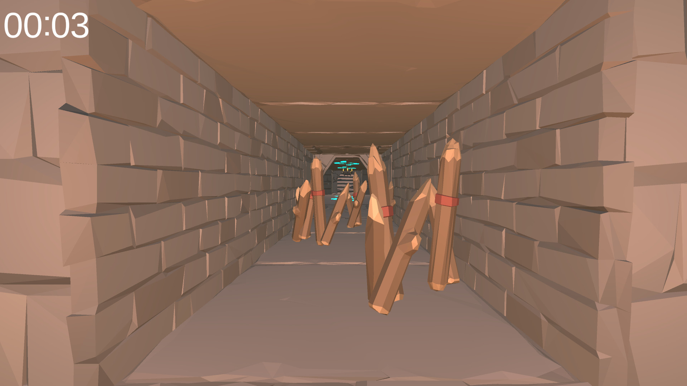
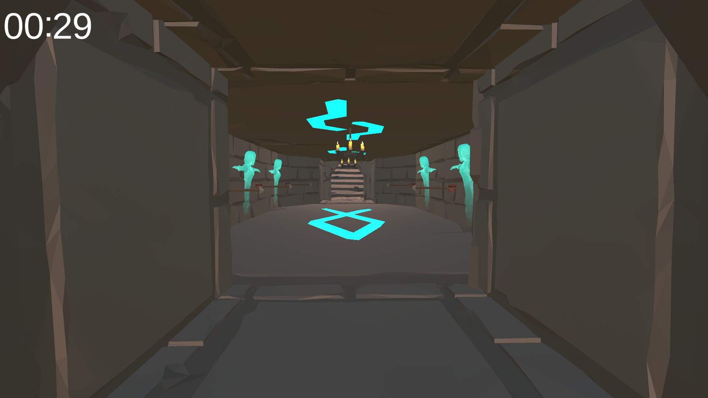
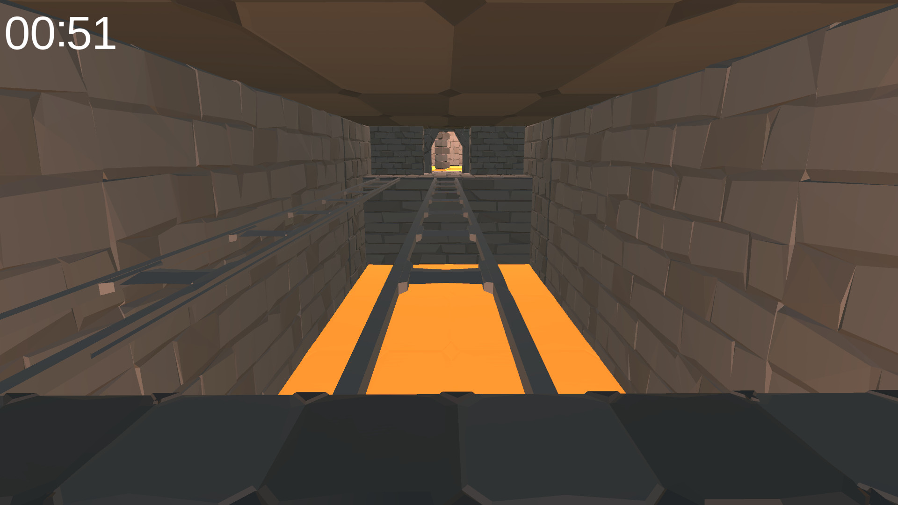
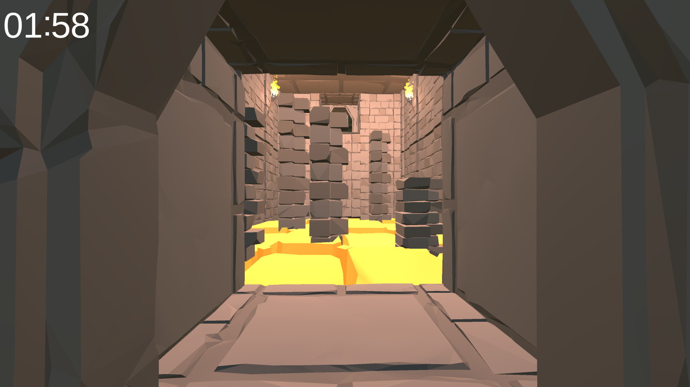
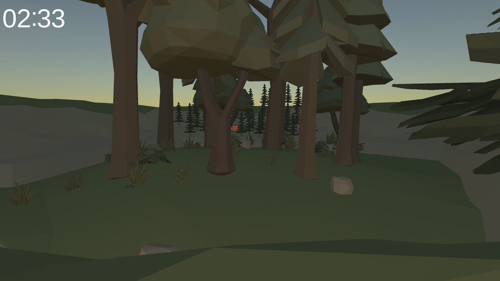
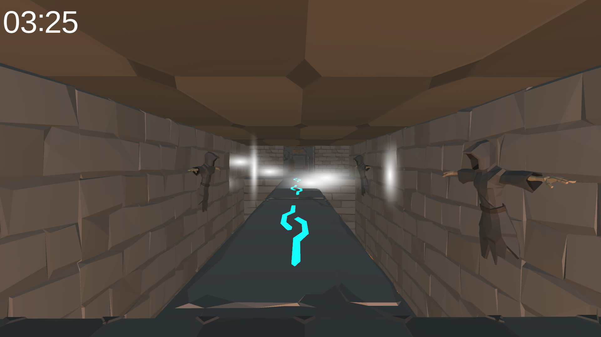
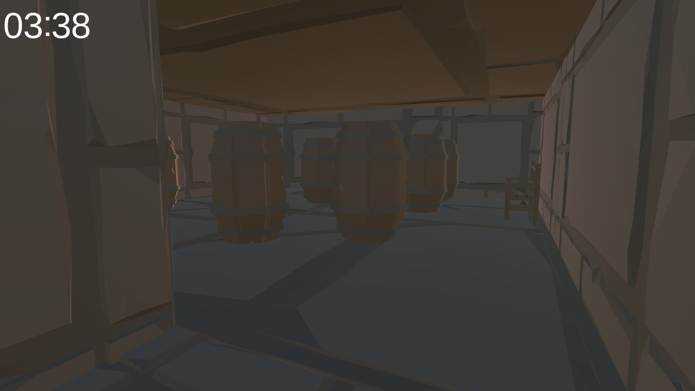
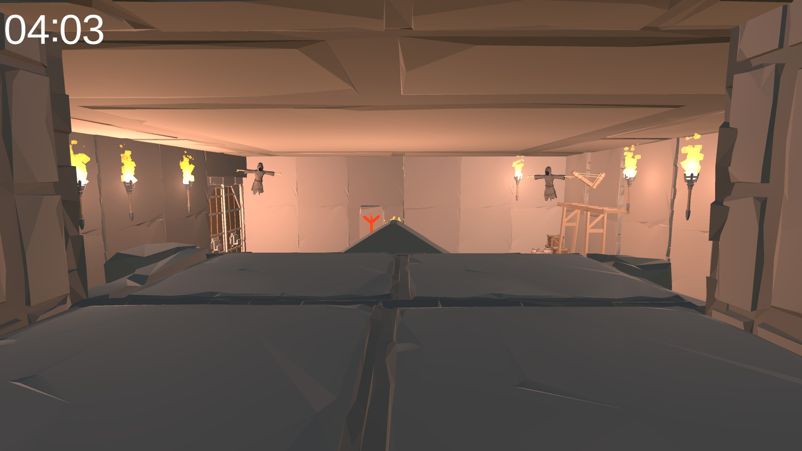
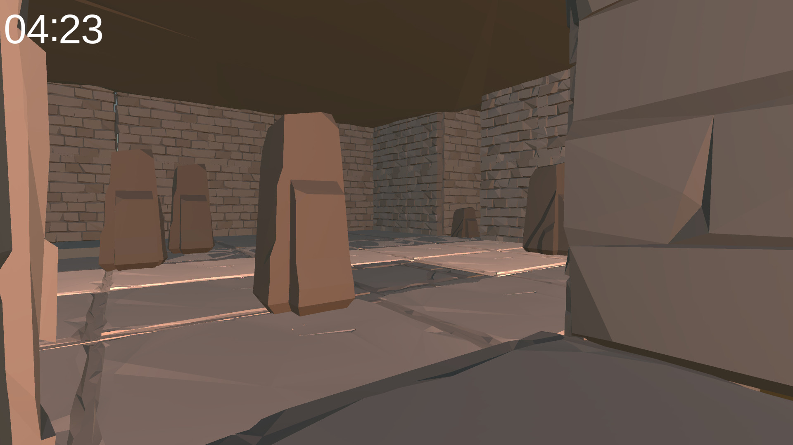
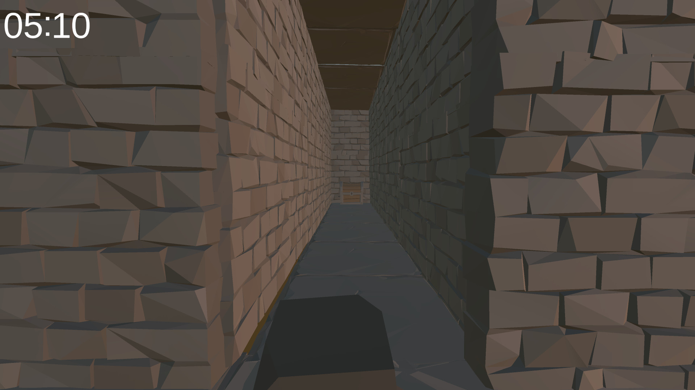

## Table of Contents

- [Introduction](#introduction)
- [Demo](#demo)
- [Usage](#usage)
- [Features](#features)
- [About](#about)

## Introduction
Last year marks the creation of my first game using Unity. It is a timed platformer where you have to go through multiple rooms, each with their own challenge. This was a solo project except for a room that was given to us to integrate into the game. The textures, meshes, or any other asset, have NOT been made by me. This is part of a school project however everything that bas been added to the game has been chosen by me except that it had to be a platformer.

## Demo

## Features
- **Multiple Levels**
- **Collectibles**
- **Dynamic obstacles** (including moving, disappearing / appearing, raising)
- **Timer** : Know how long it took you to beat the game

## Usage
### Goal
Reach the end of the game in the fastest time possible.

### Controls
| AZERTY          | Action      |
| --------------- | ----------- |
| Z               | Forward     |
| S               | Backward    |
| Q               | Left        |
| D               | Right       |
| SPACE           | Jump        |
| E               | Interact    |

**Note : the possibility to use WASD or Arrow Keys have not been added**

### Level 1
Avoid the wooden spikes.  

### Level 2
Arrows will bounce from wall to wall, don't get hit by them.  

### Level 3
The ladders that you will use to get to the next level will disappear and reappear. You will need to time your jumps in order to pass.  

### Level 4
The lava floor will rise. Jump on the stone pillars to get to the next level.  

### Level 5
Jump from rock to rock and make sure you don't any trees. Touch the red teleporter for the next level.  

### Level 6
The winds produces by the ghosts will push you off into the lava. Move into the opposite direction to not get pushed off.  

### Level 7
Three bottles are hidden. Find them all and collect them with **E** for the hidden wall to entrance to the next level to appear.  

### Level 8
They are 4 ghosts, one in each corner of the room. They will throw rocks at you, dodge them.  

### Level 9
Each pillar moves in a square fashion. From point A to B to C to D, each point corresponding to the corner of the square. With that in mind, you can deduce where the pillar will move, and pass to the final level.  

### Level 10
You have reached the end, however, as simple as it might seem, you cannot just walk to the chest. Some tiles might kil you and reset your position.  

## About
• The project assets and game content have not been included in this repository due to their size. The assets used are part of a larger pack, and to avoid unnecessary files, only the scripts have been pushed.  

• Pressing ESCAPE, will quit the game, there is not pause menu.

• The game has no sound effects nor music.
